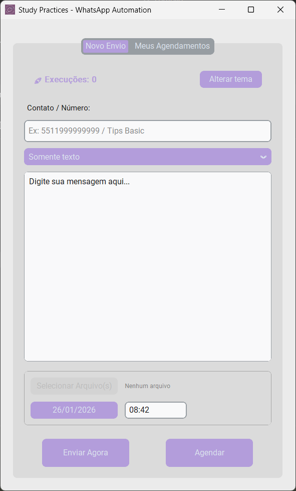

# 🤖 WhatsApp Automation Tool

<div align="center">
  <h3>📱 Interface Moderna (Modo Claro & Escuro)</h3>
  <div style="display: flex; justify-content: center; gap: 20px;">
    
    
  </div>
  <br>
  <h3>📅 Agendamento Fácil</h3>
  
</div>
<br>

---

Uma aplicação Desktop robusta para automação e agendamento de mensagens no WhatsApp, desenvolvida com Python, CustomTkinter e Playwright.


## ✨ Funcionalidades

* **Envio de Mensagens:** Suporte a Texto, Arquivos (Imagens/Documentos) ou Texto + Arquivo.
* **Agendamento Preciso:** Integração nativa com o **Agendador de Tarefas do Windows** (Task Scheduler) para execuções confiáveis mesmo com o app fechado.
* **Interface Moderna:** GUI construída com `CustomTkinter` (Tema Roxo/Lilás), suportando modo escuro/claro.
* **Gerenciamento de Sessão:** Login persistente (não precisa ler QR Code toda vez).
* **Gestão de Agendamentos:** Visualize, edite ou exclua mensagens programadas.
* **Portabilidade Total:** Funciona em qualquer pasta do Windows (Desktop, Downloads, HD externo, etc.).
* **Blindagem contra Erros:**
    * Suporte a usuários do Windows com **espaço no nome** (ex: "CAIO MAXIMUS").
    * Tratamento de processos "zumbis" do Chrome.
    * Forçamento de idioma (PT-BR) para evitar erros de seletores.
    * Encoding UTF-8 nativo para compatibilidade universal.

## 🛠️ Tecnologias Utilizadas

* **Linguagem:** Python 3.10+
* **Interface:** CustomTkinter
* **Automação:** Playwright (Sync API)
* **Agendamento:** Windows Task Scheduler (via `schtasks`, `.bat` e `.vbs`)
* **Banco de Dados:** SQLite com WAL mode (Write-Ahead Logging)
* **Empacotamento:** PyInstaller (onedir mode)

---

## 📥 Para Usuários Finais

### **Download e Instalação**

1. **Baixe o arquivo ZIP** do [Google Drive](#) (link fornecido pelo desenvolvedor)

2. **Extraia em qualquer pasta** de sua preferência:
   - ✅ `C:\Users\SeuNome\Desktop\Study_Practices\`
   - ✅ `D:\Aplicativos\Study_Practices\`
   - ✅ `C:\WhatsApp\Study_Practices\`
   - ❌ **NÃO extraia em:** `C:\Program Files\` ou `C:\Windows\` (sem permissão)

3. **Execute:** `Study_Practices.exe`

4. **Primeira vez:**
   - O programa abrirá o Chrome automaticamente
   - Leia o QR Code do WhatsApp no seu celular
   - Aguarde o WhatsApp carregar completamente
   - Pronto! Login salvo permanentemente

### **Requisitos do Sistema**

* Windows 10/11 (64-bit)
* Google Chrome ou Microsoft Edge instalado
* Conexão com a internet
* Mínimo 4GB RAM
* 500MB espaço em disco

### **Onde os Dados Ficam Salvos?**

Todos os dados ficam **dentro da pasta onde você extraiu o programa**:
```
Study_Practices/
├── Study_Practices.exe       ← Executável principal
├── _internal/                ← Arquivos do sistema (não mexa)
├── perfil_bot_whatsapp/      ← Sessão do WhatsApp (login)
├── user_data/                ← Banco de dados de agendamentos
├── logs/                     ← Histórico de execuções
└── scheduled_tasks/          ← Tarefas agendadas
```

**Importante:** Se quiser mover o programa para outra pasta, **mova a pasta inteira**, não apenas o `.exe` sozinho!

---

## 🚀 Para Desenvolvedores

### **Ambiente de Desenvolvimento**

#### Pré-requisitos
* Python 3.10 ou superior
* Google Chrome instalado
* Git (para clonar o repositório)

#### Instalação

1. **Clone o repositório:**
```bash
   git clone https://github.com/CAI0SAMPAI0/playwright.git
   cd playwright
```

2. **Crie e ative um ambiente virtual:**
```bash
   python -m venv venv
   
   # Windows:
   .\venv\Scripts\activate
   
   # Linux/Mac:
   source venv/bin/activate
```

3. **Instale as dependências:**
```bash
   pip install -r requirements.txt
```

4. **Instale o navegador do Playwright:**
```bash
   playwright install chromium
```

5. **Execute a aplicação:**
```bash
   python app.py
```

---

### **Estrutura do Projeto**
playwright/
├── core/                     # Lógica principal
│   ├── automation.py         # Controle do Playwright
│   ├── db.py                 # Gerenciamento do SQLite
│   ├── logger.py             # Sistema de logs
│   ├── paths.py              # Gerenciamento de caminhos
│   ├── scheduler.py          # Interface de agendamento
│   └── windows_scheduler.py  # Integração com Task Scheduler
│
├── ui/                       # Interface gráfica
│   └── main_window.py        # Janela principal (CustomTkinter)
│
├── data/                     # Dados persistentes